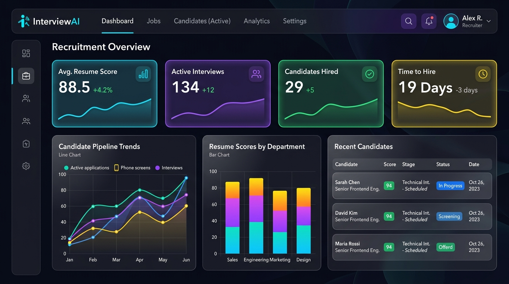
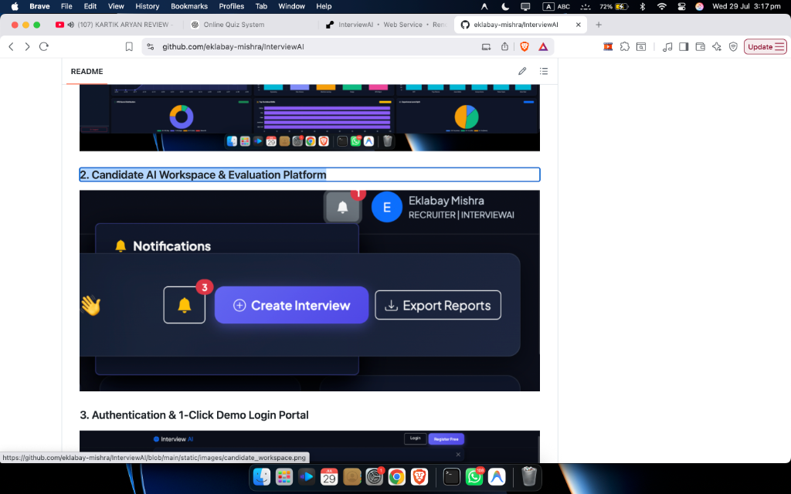
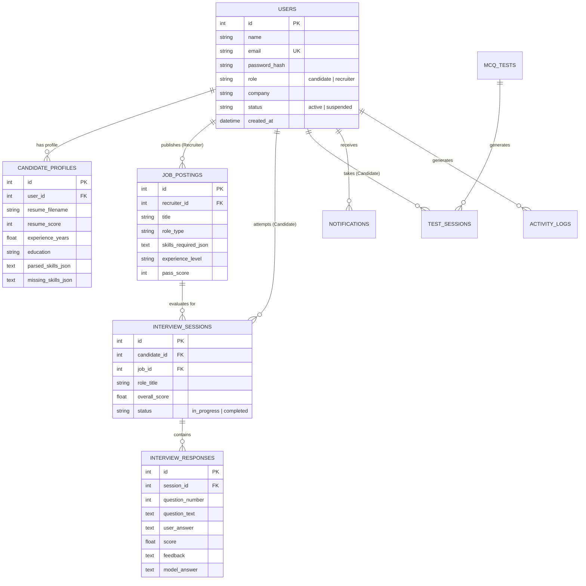

# InterviewAI – AI-Powered Technical Interview & Recruitment Platform

[](https://interviewai-h71h.onrender.com)
[](https://www.python.org/)
[](https://flask.palletsprojects.org/)
[](https://www.mysql.com/)
[](https://ai.google.dev/)
[](LICENSE)

🌐 **LIVE PRODUCTION APP**: **[https://interviewai-h71h.onrender.com](https://interviewai-h71h.onrender.com)**

An enterprise-grade, recruitment & AI evaluation platform built with **Python**, **Flask**, **MySQL**, **SQLAlchemy**, **Google Gemini AI**, **Bootstrap 5**, and **Chart.js**. **InterviewAI** streamlines technical recruitment for Senior Recruiters and interview preparation for candidates through AI resume parsing, dynamic role-specific mock interviews, automated MCQ testing, and multi-format reports.

---

## 🖼️ Application Screenshots & UI Showcase

| Enterprise Recruiter SaaS Dashboard | Candidate AI Interview Workspace |
| :---: | :---: |
|  |  |

---

## 🌟 Key Features & Dual-Portal Architecture

### 👔 1. Recruiter Portal (Default Recruiter: Eklabay Mishra - Senior Technical Recruiter)
- **Enterprise HERO Dashboard**:
  - Inspired by *LinkedIn Recruiter, Ashby, Greenhouse, HackerRank for Work, Linear, and Notion*.
  - **4 Top Summary KPI Cards with Sparklines**: Total Candidates, Active Interviews, Completed Interviews, Average Resume Score.
  - **6 Real-Database Chart.js Analytics**:
    1. *Interview Volume Trend* (Line chart)
    2. *Candidate Evaluation Performance* (Bar chart)
    3. *ATS Score Bracket Distribution* (Doughnut chart)
    4. *Top In-Demand Technical Skills* (Horizontal Bar chart)
    5. *Candidate Seniority Split* (Pie chart)
    6. *Interview Completion Rate Gauge* (Doughnut Gauge chart)
  - **Candidate Leaderboard Table**: Client-side search, Linear-style rounded filter chips (*Python*, *SQL*, *Machine Learning*, *0-2 Yrs*, *5+ Yrs*, *Score 80+*), candidate avatars, score progress bars, and pagination controls.
  - **Slide-Over Candidate Inspector Drawer Modal**: Deep-dive into candidate resume, extracted skills, past AI scorecards, and MCQ test histories without navigating away.
  - **Bulk Selection Toolbar**: Checkbox selection for instant `Bulk Shortlist` and `Bulk Reject` operations.
  - **Quick Launch Grid**: Create Interview, Create MCQ Test, View Reports, Manage Candidates.
  - **Real-Time Recruitment Activity Feed**: Event stream with color-coded status dots.
- **Reporting & Export Center**: Export candidate reports, interview evaluation scorecards, and ATS resume analytics in **PDF**, **CSV**, and **Excel (.xlsx)** formats.

### 👤 2. Candidate Portal
- **Candidate Overview Dashboard**:
  - Personal welcome banner & profile completion checklist meter.
  - Recommended Next Technical Interview card based on candidate's target role.
  - Candidate Achievement Badges (`🥷 Python Ninja`, `🛢️ SQL Master`, `🏆 Top Candidate`, `⚡ Fast Responder`).
  - Motivational AI Insights tip widget & performance trend line graph.
- **AI Resume Parser & ATS Analyzer**:
  - Upload PDF, DOCX, or TXT resumes.
  - 4-Pillar ATS Breakdown (*Formatting*, *Keywords Match*, *Technical Depth*, *Experience Alignment*).
  - Extracted technical skills & missing skill gap tags with 1-click `+ Add to Profile` buttons.
  - Downloadable ATS Analysis PDF report.
- **Role-Specific AI Technical Mock Interview Room**:
  - Role-specific question generation for *Python*, *SQL*, *OOP*, *Machine Learning / Data Science*, and *HR & Behavioral Leadership*.
  - **Difficulty Standards**:
    - **Easy**: 15 Questions | 20 Minutes (fundamental concepts & syntax).
    - **Medium**: 25 Questions | 30 Minutes (framework patterns, decorators, ORMs).
    - **Hard**: 30 Questions | 45 Minutes (CPython internals, GIL, B-Trees, microservices).
  - Speech synthesis text-to-speech audio reader toggle & simulated hardware preview.
  - Instant AI answer evaluation with score, feedback, missing concepts, and senior model answer.
- **MCQ Skill Assessment Center**:
  - Timed technical exams with question bank, instant timer, and passing score validation.
  - Official Pass Certificate generator modal (printable for scores ≥ 70%).
- **History & Attempt Comparison**:
  - Historical session records, weak topic focus areas breakdown, and side-by-side attempt comparison modal.

---

## 🏗️ Architecture & Technology Stack

### Tech Stack
- **Backend Framework**: Python 3.11, Flask (MVC Architecture)
- **ORM & Database**: SQLAlchemy, MySQL (PyMySQL) with zero-config SQLite fallback
- **AI & NLP Engine**: Google Gemini API (`google-genai` / `google-generativeai`) with intelligent rule-based NLP fallback
- **Data Analytics & Reports**: Pandas, NumPy, ReportLab (PDF), OpenPyXL (Excel)
- **Frontend & UI/UX**: HTML5, CSS3 (Glassmorphism & High-Contrast SaaS Design System), Bootstrap 5, JavaScript (ES6 AJAX), Chart.js
- **Testing**: pytest

---

## 🗄️ Database ER Diagram



---

## 🚀 Quick Start & Installation

### 1. Clone Repository & Setup Virtual Environment
```bash
git clone https://github.com/your-username/InterviewAI.git
cd InterviewAI

python3 -m venv .venv
source .venv/bin/activate
pip install -r requirements.txt
```

### 2. Initialize & Seed Database
```bash
# Creates database tables and seeds 100 Indian Candidates, distinct role question banks, and default accounts
python3 seed.py
```

### 3. Run Automated Test Suite
```bash
PYTHONPATH=. pytest
```

### 4. Launch Application
```bash
python3 app.py
```
App is live at **http://127.0.0.1:5001**.

---

## 🔑 Pre-Configured Test Accounts (With 1-Click Demo Login)

| Role | Name | Email | Password | Live 1-Click Demo Login | Local 1-Click Demo Login |
| :--- | :--- | :--- | :--- | :--- | :--- |
| **Recruiter** | Eklabay Mishra | `recruiter@interviewai.com` | `recruiter123` | [Live Recruiter Demo](https://interviewai-h71h.onrender.com/auth/demo-recruiter) | `http://127.0.0.1:5001/auth/demo-recruiter` |
| **Candidate** | XYZ | `candidate@interviewai.com` | `candidate123` | [Live Candidate Demo](https://interviewai-h71h.onrender.com/auth/demo-candidate) | `http://127.0.0.1:5001/auth/demo-candidate` |

---

## 🚢 Production Deployment Guide

### Environment Variables (`.env`)
Copy `.env.example` to `.env` and configure:
```bash
cp .env.example .env
```

### Run with Gunicorn (Production WSGI Server)
```bash
gunicorn --bind 0.0.0.0:5001 app:app
```

---

## 📄 License
Distributed under the MIT License.
